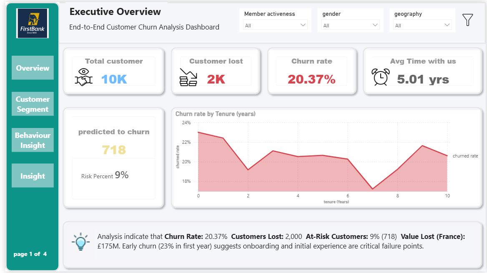
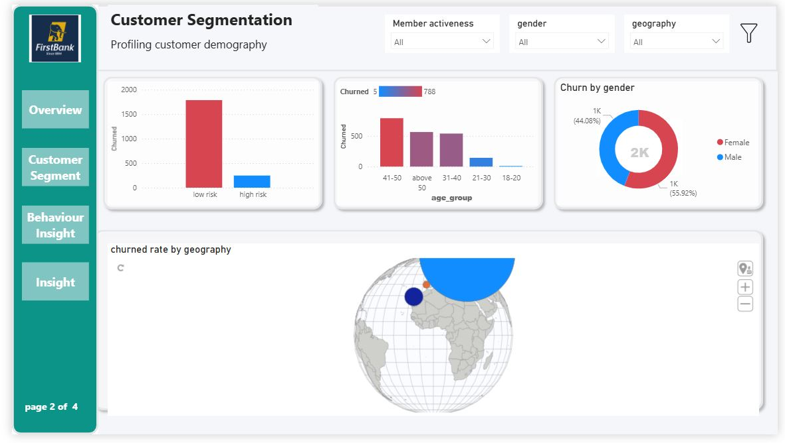
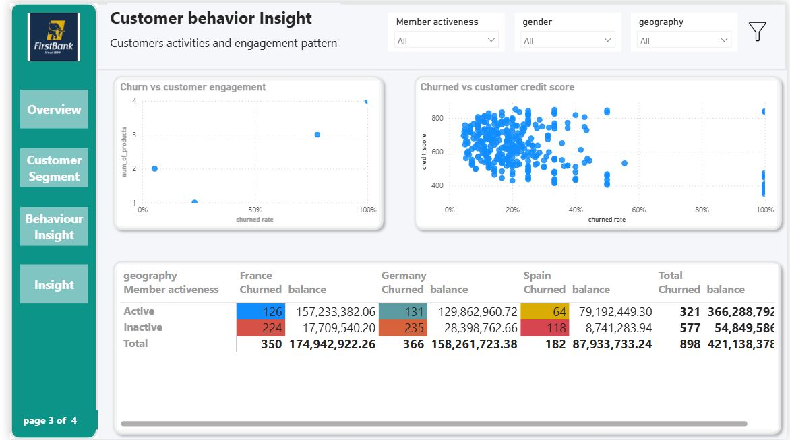
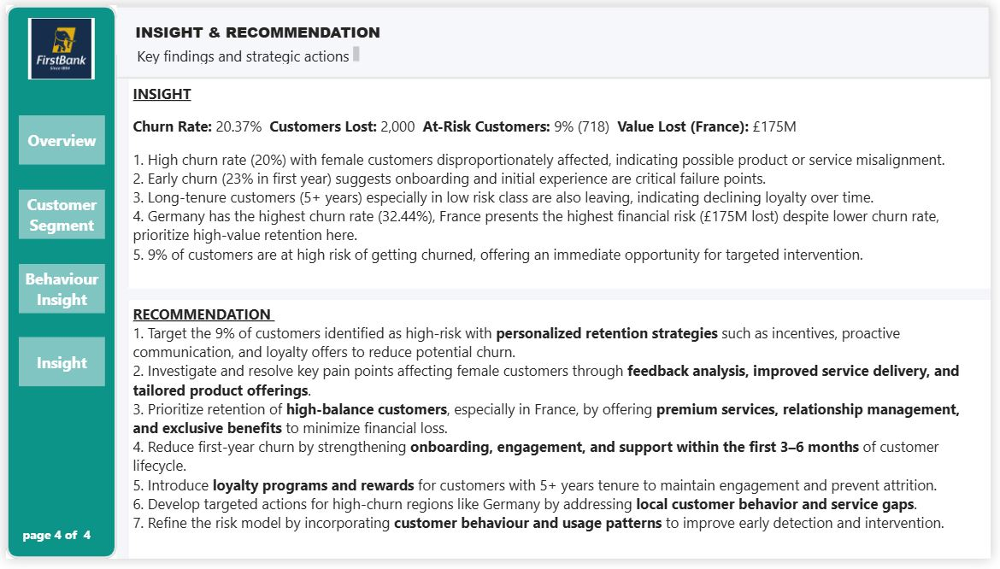

# Customer-Churn-Analysis
Interactive customer churn dashboard and data analysis to uncover retention trends and behavioral patterns in customer segments

## Project Overview

Customer churn is one of the most significant challenges faced by retail banks, as losing existing customers reduces revenue and increases acquisition costs. This project analyzes customer attrition patterns at Fizz Bank and identifies the key drivers of churn to support data-driven customer retention strategies.

The analysis was conducted using PostgreSQL for data preparation and Power BI for dashboard development and visualization.

## Business Problem

Fizz Bank is experiencing customer attrition across its European operations. The objective of this project is to identify customers at risk of leaving, understand the factors influencing churn, and provide actionable recommendations to improve retention and reduce financial losses.

## Dataset Information

**Source:** Kaggle

**Records:** 1,000 customers

**Features:** 13 columns

**File Size:** 621 KB

**Regions Covered:** Germany, France, and Spain

The dataset contains customer demographic, financial, and account information used to analyze churn behavior.

## Tools & Technologies

**PostgreSQL** – Data cleaning, transformation, feature engineering, and analysis

**Power BI** – Dashboard creation and visualization

## Data Preparation

The following preprocessing steps were completed:

Removed Customer ID and Surname fields due to confidentiality and limited analytical value.

Performed exploratory data analysis (EDA).

Created additional calculated fields:

Age Group

Credit Score Bracket

Risk Category

Developed KPIs and metrics aligned with business objectives.

Built interactive Power BI dashboards for stakeholder reporting.

## Dashboard Screenshots

## Key Findings

### Branch Performance

Germany recorded the highest churn rate at **32.44%**.

France presented the highest financial risk, with approximately **£175 million** in potential customer value loss despite a lower churn rate.

### Product Performance

Customers holding **three or more products accounted for between 75% and 100% of churn**, suggesting dissatisfaction with product value or insufficient customer engagement.

### Customer Segmentation

Female customers exhibited a disproportionately higher churn rate of approximately **20%**.

Long-tenure customers (5+ years), particularly those classified as low risk, also showed elevated attrition levels.

Approximately **9% of customers were identified as high-risk churn candidates**, representing a key retention opportunity.

### Customer Lifecycle

Early churn is a major concern, with approximately **23% of customer attrition occurring within the first year**, indicating onboarding and early customer experience challenges.

## Business Recommendations

### 1. Prioritize High-Risk Customers

Implement targeted retention campaigns for customers identified as high risk through:

Personalized communication

Loyalty incentives

Relationship management programs

### 2. Improve Female Customer Retention

Conduct customer feedback analysis and review product offerings to better align with the needs and expectations of female customers.

### 3. Protect High-Value Customers

Focus retention efforts on high-balance customers, particularly in France, through:

Premium banking services

Dedicated relationship managers

Exclusive benefits and rewards

### 4. Strengthen Customer Onboarding

Reduce first-year churn by improving:

Welcome programs

Customer education

Early engagement initiatives

Support services

### 5. Reward Customer Loyalty

Develop loyalty and rewards programs for customers with more than five years of tenure.

### 6. Address Regional Churn Drivers

Investigate service gaps and customer behavior patterns in Germany to reduce regional churn rates.

### 7. Enhance Risk Modelling

Incorporate customer behavior and usage metrics into future churn prediction models to improve early-warning capabilities.

## Limitations

The dataset does not contain a date field, limiting the ability to perform seasonality and time-series analysis.

Customer reviews and satisfaction survey data were unavailable, restricting deeper analysis of customer experience drivers.

The project focuses on descriptive and diagnostic analytics and does not include deployment of a predictive machine learning model.

## Skills Demonstrated

Data Cleaning

Data Transformation

Feature Engineering

Exploratory Data Analysis (EDA)

Customer Segmentation

Business Intelligence Reporting

KPI Development

Dashboard Design

PostgreSQL

Power BI

Business Insights & Recommendations

## Author

**Eric C. Ofondu**

MSc International Business with Data Analytics | ICAN Certified

Passionate about transforming data into actionable business insights through analytics, visualization, and decision-making support.
